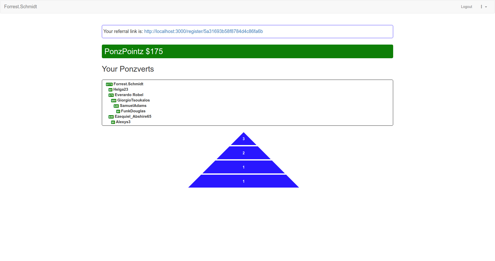

# Project Ponz

A website where users accumulate "ponz pointz" whenever someone registers an account using their referral link, or the link of someone referred by them, or the link of someone referred by the person who referred them... 

The ponz pointz are awarded in proportion to the ponzversion distance of the person who registered, starting at 40 pointz for a first degree ponzversion, and dividing by two (rounding down) for every subsequent degree until the 6th degree and above which is always 1 point.

The pyramid on the main page has a dynamic number of levels, and displays how many people were referred at every ponzversion distance, starting from the first degree. Users can also see the whole ponzversion tree, with all the users.

## Technologies

* [Node.js](https://nodejs.org/en/) - JavaScript runtime
* [Express](https://expressjs.com/) - Server architecture 
* [Redis](https://redis.io/) - NoSQL database

